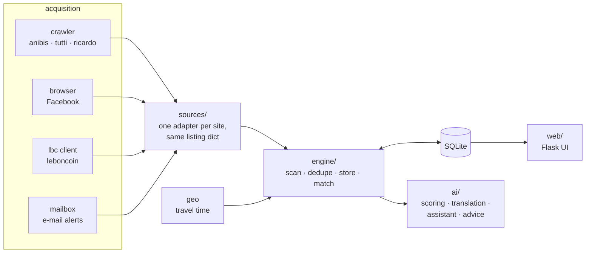

# Seconde Main

🇬🇧 English · 🇫🇷 [Français](README.fr.md) (full documentation)

A self-hosted monitor for second-hand listings in French-speaking Switzerland. You describe
what you want — the item, a price ceiling, and **how many minutes of travel** you'll accept
from one or more starting points — and a background scan collects listings from five
marketplaces into one database, scores them, and tells you when something fits.

Personal project, built in August 2026. Python, Flask, SQLite, no framework beyond that.

```bash
pip install -r requirements.txt
python -m seconde_main.seed_places   # once: postcode centroids for offline geocoding
python -m seconde_main               # http://localhost:5055
python tests/test_core.py            # 113 tests, no network, on a throwaway database
```

The app runs without any AI provider, falling back to keyword scoring. Connect one from the
**Settings** page (any OpenAI-compatible API, a local Ollama, or the Claude Code CLI).

---

## What makes it more than a scraper

- **Distance is measured in minutes, not kilometres.** "10 min on foot from EPFL" and
  "20 min by car from Grandson" can both apply to the same search. Geocoding is offline
  (GeoNames postcode centroids); OSRM and `transport.opendata.ch` refine only the borderline
  cases.
- **Nothing is ever deleted.** A listing that disappears is marked, not removed, so price
  history per product builds up over time. `db._guard` refuses an unscoped `DELETE` on the
  core tables — a test script once wiped the database twice.
- **An LLM where rules fail, and nowhere else.** Telling an iPhone apart from an iPhone case
  or a repair service; merging "IPhone 13 Pro 512 go" and "Apple iPhone 13 Pro Max 512gb"
  into one product. Translations are display-only and never feed the matching.
- **It says what it doesn't know.** A listing with no delivery information is "unspecified",
  not "pickup only"; an unknown location is kept, not filtered out as "too far".

## Sources

| Source | How | Notes |
|---|---|---|
| anibis, tutti | polite crawler | `__NEXT_DATA__` JSON, same SMG platform |
| ricardo | sitemap | 50,000 URLs published for crawlers, but no prices |
| Facebook Marketplace | real browser, your session | Playwright with your own logged-in profile, no stealth patches |
| leboncoin | **unofficial API client** | see below |

## Security and privacy decisions

The parts I'd point a reviewer to:

- **The crawler is identifiable and blockable on purpose** (`crawler.py`). Stable
  User-Agent with a contact, `robots.txt` obeyed including prose prohibitions, `crawl-delay`
  plus a 15 s per-domain floor, conditional requests, exponential back-off on 403/429/CAPTCHA,
  everything logged. No CAPTCHA solving, no stealth browser, no TLS fingerprint spoofing, no
  IP rotation. A test strips docstrings and checks the acquisition code for browser
  impersonation strings.
- **leboncoin is the exception, and I'd rather say so than hide it.** Its `robots.txt`
  forbids automated access. The first version respected that and read leboncoin's own
  alert e-mails over IMAP instead. The current version uses
  [`lbc`](https://pypi.org/project/lbc/), an unofficial client of leboncoin's internal API
  that spoofs a browser TLS fingerprint (via `curl_cffi`) to get past DataDome — exactly
  what `crawler.py` refuses to do. The adapter stays conservative: ~200 listings per cycle,
  4 s between pages, and a refusal puts the source on hold instead of being retried. Tests
  check that the crawler never touches leboncoin and that the UI never describes it as
  unvisited.
- **Scraped text is untrusted input.** It is classified, never executed, never used to build
  a URL or a command, and the prompt tells the model to ignore instructions inside it. When
  the Claude Code CLI is used, listing text goes in through `stdin`, never argv, with all
  tools disabled.
- **Credentials.** Passwords are stored as salted PBKDF2-SHA256 (200,000 rounds). The
  settings page never echoes the API key back. IMAP requires an app-specific password and is
  strictly read-only (`BODY.PEEK`, `readonly=True`).
- **Deployment defaults.** Binds to `127.0.0.1` unless told otherwise; the Docker image runs
  as a non-root user; `.dockerignore` keeps `data/` and `.env` out of the image; the app stays
  open only until the first account is created, which turns the lock on.

Known weak spot: the AI provider key is stored in plain text in `data/market.db` on your own
machine, as it was in `.env` before.

## Architecture



A scan runs in two phases: every candidate is written immediately with a keyword score, then
`engine.judge` replaces it with a model verdict. If the process dies in between,
`engine.finish_pending()` picks up what was left provisional on the next cycle.

```
seconde_main/
├── sources/       one file per marketplace, plus the adapter registry
├── engine/        scan loop, matching, storage, source health
├── ai/            provider routing, budget, scoring, assistant, recommendations
├── web/           Flask routes, one module per area of the UI
├── templates/     server-rendered pages, mobile-first
├── crawler.py     polite HTTP acquisition
├── browser.py     logged-in Chromium, Facebook only
├── mailbox.py     read-only IMAP alerts
├── geo.py         offline geocoding and travel time
├── db.py          schema, migrations, delete guard
└── auth.py · settings.py · i18n.py · ...
tests/test_core.py        113 tests, no network
docs/adding-a-source.md   the adapter contract, and pitfalls already hit (FR)
```

## The assistant

For "a pair of skis", nobody knows what to type. The assistant asks 4–6 **closed** questions
(multiple choice or yes/no, never free text), then turns the answers into a list of concrete
models — Salomon QST 99, Head Kore 99, Nordica Enforcer 100 — and searches each by name. If it
contradicts one of your stated preferences, it has to say so and explain the trade-off. A
budget is always a ceiling, never a floor.

After each scan a separate call picks **at most three** listings worth a look, with a reason
each, and is allowed to pick none. It also flags what worries it: on a test set it rejected
a bike priced 70 % below the median from a brand-new account with no ratings, unprompted. It
can propose a tweak to the search itself, but only to widen it, only with a reason visible
in the data, and never applied without a click.

## Docker

```bash
docker compose up -d --build     # then open /compte and create the first (admin) account
```

Mount `./data` or a rebuild erases your searches. Facebook doesn't work in a container: it
needs a browser with your own session.

## Limitations

- Ricardo comes from its sitemap, so it has no prices and can't be price-filtered.
- Public transport times are estimated by default and routed only when
  `transport.opendata.ch` answers.
- The scan is sequential and single-process: instant at three or four searches, would need
  per-site parallelism beyond that.
- Code comments and the UI are mostly in French.
